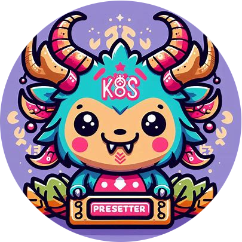

<div align="center">



# Presetter
## **Add ResourcePresets to your K8s deployments.**  

This is a custom controller, that includes ResourcePreset CRD's, which allow to create dynamic memory and CPU limits/requests configurations and automatically add them to specifically labeled Deployments.  

</div>

## Installation
This will install the operator and CRDs to your K8s cluster.  
```
helm repo add xammahelm https://xamma.github.io/helm-charts
helm repo update
helm search repo xammahelm
helm install presetter xammahelm/presetter --create-namespace -n presetter
```

## Usage
Create a **ResourcePreset CR** for your Deployment (they need to be in the same namespace):
```
apiVersion: presetter.xamma.dev/v1
kind: ResourcePreset
metadata:
  labels:
    app.kubernetes.io/name: presetter
  name: minimal
  namespace: presets
spec:
  cpuRequests: "200m"
  cpuLimits: "500m"
  memoryRequests: "400Mi"
  memoryLimits: "1Gi"
```

Now, add a Label ```presetter.xamma.dev/preset``` with the corresponding name to your deployment like this:
```
apiVersion: apps/v1
kind: Deployment
metadata:
  name: example-deployment
  namespace: presets
  labels:
    app: example-app
    presetter.xamma.dev/preset: "minimal" # Label to match ResourcePreset
spec:
  replicas: 3
  selector:
    matchLabels:
      app: example-app
  template:
    metadata:
      labels:
        app: example-app
    spec:
      containers:
      - name: example-container
        image: nginx:latest
        ports:
        - containerPort: 80
        # No resources specified here; will be added by the controller
```

Done! The Presetter will now add the Resource/CPU requests and limits to the containers in your Deployment :)  
